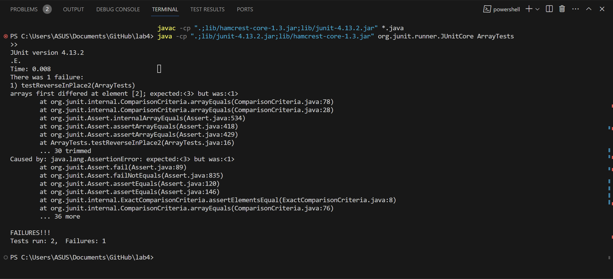

#  Lab Report 3

The error I choose was from the ArrayExamples class.
A failure-inducing input would be:
```
@Test 
public void testReverseInPlace2() {
    int[] input1 = { 3,2,1 };
    ArrayExamples.reverseInPlace(input1);
    assertArrayEquals(new int[]{ 1,2,3 }, input1);
}
```
An input that does not fail would be:
```

@Test 
public void testReverseInPlace() {
    int[] input1 = { 3 };
    ArrayExamples.reverseInPlace(input1);
    assertArrayEquals(new int[]{ 3 }, input1);
}
```
The symptom of the failure-inducing input that the element of index 2 of the actual output of the testReverseInPlace2 method is 3 when it should be 1. Here is the screenshot:

The part of the code containing the bug:
```
static void reverseInPlace(int[] arr) {
    for(int i = 0; i < arr.length; i += 1) {
        arr[i] = arr[arr.length - i - 1];
    }
}
```
For testReverseInPlace, divide the arr.length in the condition statement in the for loop by 2 and create a new int variable to store the current arr[i] before copying arr[arr.length - i - 1] to arr[i]. Then copy the value in current to arr[arr.length - i - 1]. The code after the fix is:
```
static void reverseInPlace(int[] arr) {
    for(int i = 0; i < arr.length/2; i += 1) {
        int temp = arr[i];
        arr[i] = arr[arr.length - i - 1];
        arr[arr.length - i - 1] = temp;
    }
}
```
